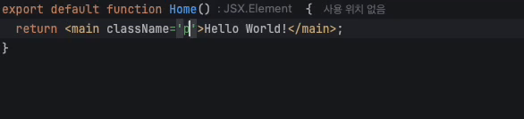

# Tailwind Simple Typography

A simple typography plugin for Tailwind CSS.



You can set up `fontFamily`, `fontWeight`, `fontSize`, and `lineHeight` easily and quickly.

## Installation

```bash
npm install twind-simple-typography
yarn add twind-simple-typography
pnpm add twind-simple-typography
```

## Usage

### 1. Please prepare the font in advance for use on the web.
Example: [`Pretendard`Link](https://github.com/orioncactus/pretendard?tab=readme-ov-file#%EC%9B%B9%ED%8F%B0%ED%8A%B8)


### 2. Add the plugin to your `tailwind.config.js` file:

```js
// tailwind.config.js
module.exports = {
  ...
  plugins: [
    ...
    require('twind-simple-typography')({
        fontFamilyMap: {
            'pretendard-normal': {
                weight: 400,
                family: '"Pretendard", sans-serif',
            },
            'pretendard-bold': {
                weight: 700,
                family: '"Pretendard", sans-serif',
            },
        },
        fontSizeList: [
            80, 60, 40, 35, 30, 28, 25, 22, 20, 18, 15, 13, 12, 11, 10,
        ],
        lineHeightList: [130, 160],
    }),
  ],
}
```
Option interface:
```typescript
type FontFamilyMap = Record<
    string,
    {
        weight: number;
        family: string;
    }
>;
type FontSizeList = number[];
type LineHeightList = number[];

interface TypographyOptions {
    fontFamilyMap?: FontFamilyMap;
    fontSizeList?: FontSizeList;
    lineHeightList?: LineHeightList;
}
```

### 3. Use the classes:

```jsx
<!-- React -->
<div className="pretendard-normal-13-130">
  Hello, world!
</div>
```

## Authors
nonameP765 - nonamep@setsuna.kr

## Code
[GitHub](https://github.com/nonameP765/twind-simple-typography)
